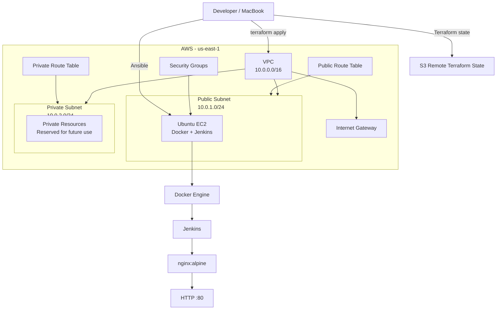
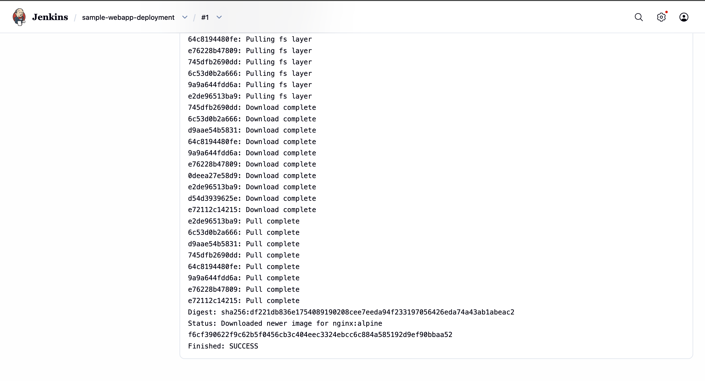
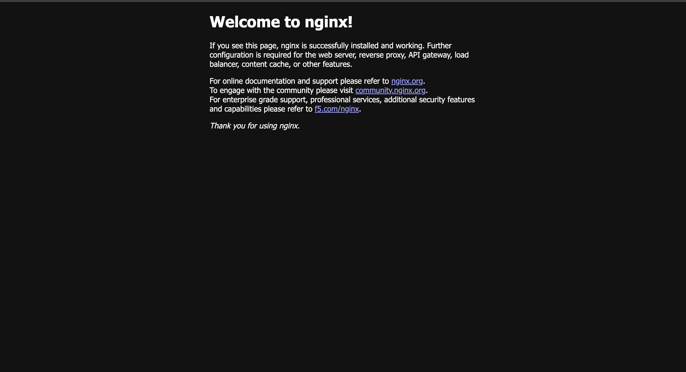

# Automated AWS Infrastructure Provisioning

> Infrastructure as Code project that provisions AWS infrastructure with **Terraform** and automatically configures the provisioned EC2 server using **Ansible**, including Docker and Jenkins installation and a sample Nginx deployment.

## 📌 Project Overview

This project demonstrates an end-to-end DevOps workflow in which AWS infrastructure is created without manually configuring the AWS Console.

The workflow is:

**Terraform → AWS Infrastructure → Ansible → Docker → Jenkins → Nginx**

Terraform provisions the networking and EC2 infrastructure. Ansible then connects to the EC2 instance and configures the operating system, installs Docker and Jenkins, and prepares the server for containerized application deployment.

A Jenkins job is used to pull and run an Nginx container, making the complete provisioning-to-deployment flow demonstrable.

---

## 🏗️ Architecture



### Architecture Flow

1. Terraform creates the AWS VPC and networking components.
2. A public EC2 instance is provisioned inside the public subnet.
3. Ansible connects to the EC2 instance over SSH.
4. Ansible installs and configures Docker.
5. Ansible installs and configures Jenkins.
6. Jenkins is granted permission to execute Docker commands.
7. A Jenkins job pulls the `nginx:alpine` image and starts the container.
8. Nginx is exposed on port `80`.
9. The deployed application can be accessed through the EC2 public IP.

---

## 🛠️ Technologies Used

| Technology | Purpose |
|---|---|
| AWS | Cloud infrastructure |
| Terraform | Infrastructure as Code |
| Ansible | Server configuration and automation |
| Ubuntu 24.04 LTS | EC2 operating system |
| Docker | Containerization |
| Jenkins | CI/CD automation |
| Nginx | Sample containerized web application |
| Amazon S3 | Remote Terraform state |
| Git & GitHub | Version control |
| SSH | Secure server access |

---

## ☁️ AWS Infrastructure

Terraform provisions:

- Custom VPC: `10.0.0.0/16`
- Public subnet: `10.0.1.0/24`
- Private subnet: `10.0.2.0/24`
- Internet Gateway
- Public and private route tables
- Security groups
- Ubuntu EC2 instance
- IAM/networking configuration required by the infrastructure

### Cost Optimization

To keep the project cost-effective:

- Only one EC2 instance is used.
- No Application Load Balancer is used.
- No RDS instance is used.
- No NAT Gateway is used because NAT Gateway hourly and data-processing charges can add significant cost to a small learning project.
- No Elastic IP is permanently allocated.
- The EC2 instance can be stopped when the project is not being used.
- Terraform state is stored remotely in S3.

> The private subnet is included to demonstrate VPC architecture, but the current deployment does not require private-subnet resources to access the internet.

---

## 📁 Project Structure

```text
automated-aws-infrastructure/
│
├── ansible/
│   ├── ansible.cfg
│   ├── inventory.ini
│   ├── playbook.yml
│   │
│   └── roles/
│       ├── docker/
│       │   ├── handlers/
│       │   │   └── main.yml
│       │   └── tasks/
│       │       └── main.yml
│       │
│       └── jenkins/
│           ├── handlers/
│           │   └── main.yml
│           └── tasks/
│               └── main.yml
│
├── terraform/
│   ├── main.tf
│   ├── variables.tf
│   ├── vpc.tf
│   ├── security-groups.tf
│   ├── ec2.tf
│   ├── outputs.tf
│   ├── .terraform.lock.hcl
│   │
│   └── bootstrap/
│       ├── main.tf
│       ├── variables.tf
│       ├── outputs.tf
│       └── terraform.lock.hcl
│
├── .gitignore
└── README.md
```

---

# 🚀 Setup and Deployment

## Prerequisites

Install/configure:

- AWS account
- AWS CLI
- Terraform
- Ansible
- Git
- SSH
- An AWS EC2 key pair

Verify the tools:

```bash
aws --version
terraform --version
ansible --version
git --version
ssh -V
```

Configure AWS credentials:

```bash
aws configure
```

Verify the AWS identity:

```bash
aws sts get-caller-identity
```

---

# 1️⃣ Clone the Repository

```bash
git clone git@github.com:Puneeth2204/automated-aws-infrastructure.git
cd automated-aws-infrastructure
```

---

# 2️⃣ Bootstrap Terraform Remote State

The bootstrap configuration creates the resources used for Terraform remote state management.

Go to the bootstrap directory:

```bash
cd terraform/bootstrap
```

Initialize Terraform:

```bash
terraform init
```

Review the plan:

```bash
terraform plan
```

Apply the bootstrap infrastructure:

```bash
terraform apply
```

The bootstrap configuration creates the S3 bucket used for Terraform state.

Return to the main Terraform directory:

```bash
cd ..
```

---

# 3️⃣ Configure Terraform

Update `terraform.tfvars` with your environment-specific values.

Do **not** commit credentials, private keys, or sensitive environment-specific values.

The repository `.gitignore` excludes:

```text
*.tfstate
*.tfstate.*
*.tfvars
*.pem
```

Initialize Terraform:

```bash
terraform init
```

Terraform uses the S3 backend configured in `main.tf`:

```hcl
backend "s3" {
  bucket       = "automated-aws-tfstate-puneeth-2026"
  key          = "dev/terraform.tfstate"
  region       = "us-east-1"
  use_lockfile = true
}
```

---

# 4️⃣ Provision AWS Infrastructure

Review the execution plan:

```bash
terraform plan
```

Apply the infrastructure:

```bash
terraform apply
```

Terraform provisions:

- VPC
- Subnets
- Internet Gateway
- Route tables
- Security groups
- EC2 instance

After deployment, retrieve the Terraform outputs:

```bash
terraform output
```

---

# 5️⃣ Configure the EC2 Instance with Ansible

Update the Ansible inventory with the current EC2 public IP or DNS name.

Example:

```ini
[webservers]
aws_server ansible_host=<EC2_PUBLIC_IP> ansible_user=ubuntu ansible_ssh_private_key_file=~/.ssh/<AWS_KEY>.pem
```

Test SSH connectivity through Ansible:

```bash
ansible webservers -m ping
```

Run the complete configuration:

```bash
ansible-playbook -i inventory.ini playbook.yml
```

The playbook:

1. Updates the APT package cache.
2. Installs required utilities.
3. Installs Docker.
4. Starts and enables Docker.
5. Adds the required users to the Docker group.
6. Installs Java.
7. Adds the Jenkins repository and signing key.
8. Installs Jenkins.
9. Starts and enables Jenkins.
10. Configures Jenkins to work with Docker.

---

# 6️⃣ Verify Docker

SSH into the EC2 instance:

```bash
ssh -i ~/.ssh/<AWS_KEY>.pem ubuntu@<EC2_PUBLIC_IP>
```

Check Docker:

```bash
docker --version
```

Check the service:

```bash
systemctl is-active docker
```

Run the Docker test container:

```bash
docker run --rm hello-world
```

Verify that Jenkins can access Docker:

```bash
sudo -u jenkins docker ps
```

---

# 7️⃣ Verify Jenkins

Open Jenkins:

```text
http://<EC2_PUBLIC_IP>:8080
```

Complete the initial Jenkins setup.

The project includes a Jenkins job named:

```text
sample-webapp-deployment
```

The job pulls the Nginx image and starts the sample web application container.

---

# 8️⃣ Verify the Nginx Deployment

Check running containers:

```bash
sudo -u jenkins docker ps
```

Expected container:

```text
nginx:alpine
```

Test locally on the EC2 instance:

```bash
curl -I http://localhost
```

Expected response:

```text
HTTP/1.1 200 OK
Server: nginx
```

Then open:

```text
http://<EC2_PUBLIC_IP>
```

You should see the default Nginx welcome page.

---

# 🔄 End-to-End Workflow

```text
Developer
   │
   ▼
Terraform
   │
   ├── VPC
   ├── Subnets
   ├── Internet Gateway
   ├── Route Tables
   ├── Security Groups
   └── EC2
        │
        ▼
     Ansible
        │
        ├── Docker
        └── Jenkins
              │
              ▼
          Jenkins Job
              │
              ▼
        Docker Pull
              │
              ▼
        nginx:alpine
              │
              ▼
           Port 80
              │
              ▼
          Web Browser
```

---

# 🔐 Security Considerations

The project follows several basic security practices:

- Terraform state is stored in a private S3 bucket.
- S3 public access is blocked.
- S3 server-side encryption is enabled.
- AWS credentials are not stored in the repository.
- EC2 private keys are excluded using `.gitignore`.
- Terraform state files are excluded from Git.
- SSH access should be restricted to your own public IP rather than `0.0.0.0/0`.
- Jenkins should not be exposed publicly in a production environment without additional security controls.
- The sample infrastructure is intended for learning and portfolio demonstration, not production workloads.

---

# 💰 Cost Management

This project is designed as a low-cost learning environment.

Recommended workflow when finished working:

```bash
aws ec2 stop-instances \
  --instance-ids <INSTANCE_ID> \
  --region us-east-1
```

Stopping the EC2 instance avoids ongoing compute charges while preserving its EBS-backed data.

When the project is completely finished and no longer needed, destroy the infrastructure:

```bash
terraform destroy
```

If the Terraform bootstrap resources are also no longer required, destroy them separately:

```bash
cd terraform/bootstrap
terraform destroy
```

> Always verify the Terraform plan before destroying infrastructure.

---

# 🧪 Validation Performed

The complete workflow was tested successfully.

### Terraform

- Terraform initialization completed.
- Remote S3 state configured.
- VPC and subnet infrastructure provisioned.
- EC2 instance provisioned successfully.

### Ansible

- EC2 connectivity verified.
- Full playbook completed successfully.
- Docker role executed successfully.
- Jenkins role executed successfully.

### Docker

- Docker service active.
- `hello-world` container executed successfully.
- Jenkins user successfully executed Docker commands.

### Jenkins

- Jenkins dashboard accessible.
- `sample-webapp-deployment` job created.
- Jenkins build completed successfully.
- Nginx image pulled and deployed.

### Application

- Nginx container running.
- Port `80` accessible.
- `curl` returned HTTP `200 OK`.
- Nginx welcome page accessible through the EC2 public IP.

---

# 📸 Screenshots

### Jenkins Build — `sample-webapp-deployment` (SUCCESS)

Console output showing the Jenkins job pulling the `nginx:alpine` image and completing successfully.



### Nginx Deployment — Live via EC2 Public IP

The default Nginx welcome page, served from the container deployed by the Jenkins job and reachable at `http://<EC2_PUBLIC_IP>`.



---

# 📊 Project Outcome

This project demonstrates practical experience with:

- Infrastructure as Code
- AWS networking
- Terraform
- Remote Terraform state
- Linux server administration
- Ansible automation
- Ansible roles
- Docker
- Jenkins
- Containerized application deployment
- Git/GitHub
- Cloud cost optimization
- End-to-end DevOps automation

---

# 🔮 Possible Future Improvements

The current project intentionally keeps the architecture small and cost-conscious. Possible extensions include:

- Add a NAT Gateway when private-subnet internet access is required.
- Add an Auto Scaling Group.
- Add an Application Load Balancer.
- Add a private EC2 application tier.
- Add Amazon RDS.
- Add Terraform modules.
- Add a complete Jenkins CI/CD pipeline connected to GitHub webhooks.
- Add SonarQube for code quality analysis.
- Add Kubernetes deployment.
- Add monitoring with Amazon CloudWatch.
- Add HTTPS using ACM and an Application Load Balancer.
- Add automated infrastructure validation in CI.

---

## 👨‍💻 Author

**Puneeth K G**

Computer Science / Information Science Engineering undergraduate focused on:

- DevOps
- AWS Cloud
- Terraform
- Ansible
- Docker
- Jenkins
- CI/CD
- Linux

GitHub: `Puneeth2204`

---

## 📄 License

This project is intended for educational and portfolio purposes.
